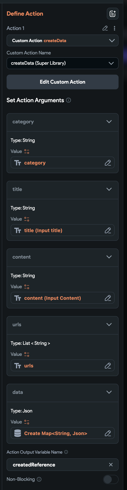

# Data

Imagine you are building a social app that displays users' tweets, photos, and comments on a scrollable main screen. If your app grows, using Firestore can become expensive due to the costs associated with reading, writing, and downloading the size of documents from Firestore.

Using the Realtime Database is faster, cheaper, and simpler.

## Features

The `Data` provides default CRUD operations for the Realtime Database:

- **readData**: Custom action to read data.
- **createData**: Custom action to create data.
- **updateData**: Custom action to update data.
- **deleteData**: Custom action to delete data.
- **DataListView**: Widget to display a list of values in a data group.
- **Data**: Widget to display a value of the data.

With the `Comment`, you can easily build blog or forum community apps. Refer to the `Comment` documentation for more details.

## Suggested Use Cases

If you want to build the following features in your apps, `Data` functionality is good;

- Blogs, News, Reminders
- Forum (Built-in BBS) based community apps
- Social apps with listing/scrolling activity wall screen
- Shopping mall apps
- Any functionality that related in creating and listing articles

## Installation

```json
"data": {
  ".read": true,
  "$key": {
    ".write": "newData.child('uid').val() === auth.uid || ( data.child('uid').val() === auth.uid && !newData.exists() )",
    "category": {
      ".validate": "newData.val().length > 0"
    }
  }
},
```

## Database Structure

To achieve the concept of `SSOT` (Single Source of Truth), we save all data in the `/data` node in the Realtime Database.

### Security

- To prevent attacks that involve writing excessively large data (e.g., very long titles or content), you can add security rules to limit the size of these fields.
    - By default, the title is limited in `2048` letters and the content is limited in `65536` letters by the security rules. You can change them and add more rules.

### Data Format

- Data in the Realtime Database is stored in JSON format.
- The first level of keys in the `/data` node are the IDs of the data entries.
- The second level of keys are the properties of each data entry.

### Example Structure

```json
/data {
    "key-1": {
        "property-1": "...",
        "property-2": "..."
    },
    "key-2": {
        "property-1": "...",
        "property-2": "..."
    }
}
```

### Fields of a Node

- **uid**: The creator's user ID.
- **category**: The category of the data, ordered by recent data(article).
- **order**: The order of the data.
- **title**: The title of the data.
- **content**: The content of the data.
- **urls**: URLs of photos and files associated with the data.
- **createdAt**: The creation timestamp.
- **updatedAt**: The update timestamp.
- **custom fields**: You can add as much extra fields as you want.

Example representation:

```json
/data
  /key-1 {
    "category": "qna-1630000000000",
    "order": -1630000000000,
    "uid": "uid",
    "title": "title",
    "content": "content",
    "urls": ["url1", "url2"],
    "createdAt": 1630000000000,
    "updatedAt": 1630000000000
  }
```

## Openning data list screen

- Create a screen to list the data.
    - Let's name it as `DataListScreen`.
    - Add a required page parameter named `category` with the type of String.
- Insert the `DataListView` in the body passing the `category` page parameter.
- Add a create button on the app bar.
    - When the user taps, open the `DataCreateScreen`.

## Create a data

- Create a screen to create a data.
    - Let's name it as `DataCreateScreen`.
    - Add a required page parameter named `category` with the type of String.
- Add some text fields with submit button.
    - Text field of title, content would be needed.
    - You can add any extra fields(key/value pair) into the data.
- When the user taps on the submit button, you can connect the `createData` custom action like below.
    - Use `Create Map` to save extra data into the data.



- You may navigate back the screen after the `createData` action.

## Custom design on data list screen

- If you want to design with your component, you can hook your component into super library.
- Create a component named `DataCard` under the `components/data` folder. See below;


- Add the `data` parameter of `JSON` type to the `DataCard` component.


- Then, you need to hook your component into super library by creating a custom action like below;

```dart
data_card_widget_tree.png
```

- If you want to customize 


## Developer's guide line

### To get data of a category in order

```dart
final ref = PostService.instance.postsRef
    .orderByChild('category')
    .startAt('$category-')
    .endAt('$category-9999999999999999999999');

final snapshot = await ref.get();
for (var v in snapshot.children) {
  log('v: ${v.key}, value: ${(v.value as Map)["title"]}');
}
```